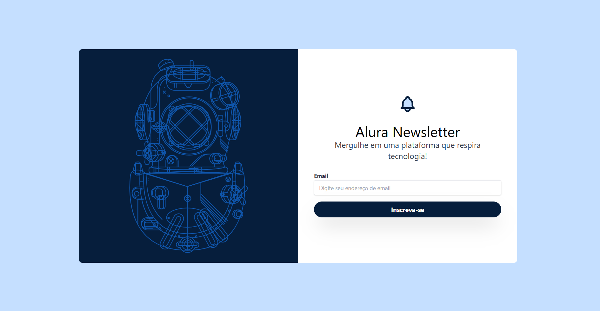

# AluraPlay

## ℹ️ Sobre

Projeto utilizado no curso para aprendizado das técnicas e melhores práticas.

## 📘Ementa

### Tailwind CSS: estilizando a sua página com classes utilitárias

- Construir um projeto utilizando Tailwind CSS
- Identificar quais as principais diferenças entre o Bootstrap e o Tailwind CSS
- Implementar customizações em seu projeto com o tailwind.config
- Modificar o alinhamento e posicionamento dos elementos
- Experimentar estilizar elementos com o uso das classes utilitárias
- Produzir uma animação do zero para a Alura Newsletter

## 🖥️ Tecnologias

  
  
  

## 🧑‍🏫 Instrutor(es)

| [ Beatriz Moura](https://github.com/beatrizmouradev) |
| :---------------------------------------------------------------------------------------------------------------------------------------------------------------------------------------------------------------------------------------------------------------------------------------------------------------------------: |

## 💻 Screenshot

#### Mobile

  
  
  #### Tablet
  
  
  #### Desktop
  

